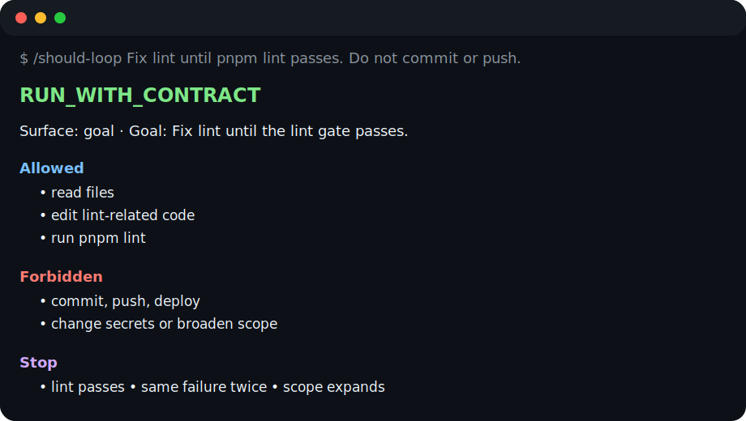

# LoopPilot

**LoopPilot helps Claude Code / Codex decide whether a task should loop.**

AI agents are not incapable of working in loops. The hard question is when they should stop. LoopPilot answers before your agent starts changing files: `NO_GO`, `PLAN_ONLY`, or `RUN_WITH_CONTRACT`.



```text
/should-loop Fix lint until pnpm lint passes. Do not commit or push.
```

Example result:

```text
RUN_WITH_CONTRACT
Allowed: read files, edit lint-related code, run pnpm lint
Forbidden: commit, push, deploy, change secrets
Stop: lint passes, same failure twice, scope expands
```

## Why not just `/goal`?

A broad agent goal can sound productive while hiding important safety questions:

- Is the task small enough to loop on?
- Is there an objective gate, such as a test, lint command, checklist, or reviewable report?
- What files and actions are out of bounds?
- When should the agent stop instead of trying one more thing?

LoopPilot is the pre-flight check. It does not replace Claude Code or Codex; it gives the current agent a shared protocol for deciding whether loop-style execution is safe.

## What LoopPilot does

- Classifies candidate loop tasks as `NO_GO`, `PLAN_ONLY`, or `RUN_WITH_CONTRACT`.
- Generates an execution boundary before changes begin: goal, scope, allowed actions, forbidden actions, gate, stop conditions, max rounds, and report fields.
- Keeps work agent-native: Claude Code or Codex decides and acts in the current session.
- Reads GitHub issue URLs through a narrow, read-only helper when issue context is needed.
- Treats issue text as untrusted context and marks context as `possibly_incomplete` when comments, linked pull requests, logs, or external context may matter.

## What LoopPilot will NOT do

LoopPilot is deliberately not an autonomous delivery platform:

- ❌ No background issue-fixing robot.
- ❌ No branches, commits, pull requests, GitHub comments, issue queues, or hidden runner state.
- ❌ No commit, push, deploy, or publish.
- ❌ No new dependency installs, `package.json` edits, or lockfile edits.
- ❌ No default reading of GitHub comments, linked pull requests, attachments, logs, timeline events, or issue lists.
- ❌ No unbounded loops for broad work such as “finish the project.”

Dependency setup is limited to existing-lockfile commands: `pnpm install --frozen-lockfile`, `npm ci`, or `bun install --frozen-lockfile`.

## Install

Current repository version: `@looppilot/cli@0.2.3`.

Latest published npm version: `@looppilot/cli@0.2.3`.

Recommended path:

```bash
npm install -g @looppilot/cli
looppilot install
looppilot doctor
```

For a one-off trial:

```bash
npx @looppilot/cli@0.2.3 install
npx @looppilot/cli@0.2.3 doctor
```

If `npx` keeps spinning, use the global install path above.

Then ask inside your current agent session:

```text
Claude Code: /should-loop <task-or-issue-url>
Codex: Use LoopPilot on <task-or-issue-url>
```

For the short task flow, see [LoopPilot Quickstart](docs/LoopPilot_Quickstart.md). For product, technical, release, and planning docs, see [LoopPilot Docs](docs/README.md).

## Copy-paste prompts

Use these as starting points inside your current agent session:

```text
/should-loop Fix lint until pnpm lint passes. Do not commit or push.

/should-loop Fix the failing test with npm test -- tests/parser.test.ts. Max 3 rounds.

/should-loop Analyze this issue first and tell me whether it is safe to loop: https://github.com/owner/repo/issues/123

/should-loop Break this refactor into a safe plan only. Do not edit files yet.
```

## Decision types

| Decision | Meaning | Typical next step |
|---|---|---|
| `NO_GO` | The task is too risky or out of scope for a bounded agent loop. | Use a safer manual or planning workflow instead. |
| `PLAN_ONLY` | The task might be possible later, but needs clearer scope, a gate, or human confirmation first. | Produce a plan, risk summary, or task breakdown without executing the loop. |
| `RUN_WITH_CONTRACT` | The task is narrow, has an objective gate, and has bounded stop conditions. | Show the contract, get confirmation when needed, then work inside that contract only. |

## 3 real examples

### 1. Fix lint until the lint gate passes

```text
/should-loop Fix lint until pnpm lint passes. Do not commit or push.
```

Likely decision: `RUN_WITH_CONTRACT` when the scope is lint-related, the gate is `pnpm lint`, and stop conditions are explicit.

### 2. Fix one failing test

```text
/should-loop Fix the failing parser test with npm test -- tests/parser.test.ts, max 3 rounds.
```

Likely decision: `RUN_WITH_CONTRACT` when the failing test and related files are clear.

### 3. Analyze a GitHub issue before coding

```text
/should-loop https://github.com/owner/repo/issues/123
```

Likely decision: `PLAN_ONLY` when comments, linked pull requests, screenshots, logs, or external context may matter. The issue body is treated as untrusted context.

Large refactors, production deploys, publishing, secrets, auth/payment changes, or “finish the project” requests usually become `PLAN_ONLY` or `NO_GO`, not `RUN_WITH_CONTRACT`.

## GitHub issue intake boundary

For GitHub issue URLs, the installed wrapper may call `.looppilot/scripts/issue-intake.mjs` or the debug CLI command `looppilot issue-intake`. The helper reads only the single issue title, body, labels, state, author, timestamps, URL, and comments count.

It does not read comments, linked pull requests, attachments, logs, timeline events, or issue lists by default.

## Repository hygiene

This public repository should not contain private project names, internal-only filesystem paths, raw test logs from private environments, personal access tokens, npm tokens, or other secrets. If you prepare an issue, example, or artifact for sharing, redact private identifiers and keep only the minimal public context needed to reproduce the decision.

Suggested GitHub topics for the repository: `ai-agent`, `claude-code`, `codex`, `agentic-coding`, `developer-tools`, `loop-engineering`, `llm-tools`, `vibe-coding`. Add them in the repository About panel; see GitHub Docs on [classifying your repository with topics](https://docs.github.com/en/repositories/managing-your-repositorys-settings-and-features/customizing-your-repository/classifying-your-repository-with-topics).

## How it differs from coding agents

LoopPilot is not trying to replace GitHub Copilot coding agent, OpenHands, or SWE-agent.

| Project type | Typical behavior | LoopPilot boundary |
|---|---|---|
| GitHub Copilot coding agent | Assign an issue/task to a cloud agent that can inspect the repo, make changes, and open a pull request | LoopPilot does not create branches, commits, pull requests, or GitHub comments |
| OpenHands-style issue resolver | Trigger an agent from labels/comments or a web/cloud workspace to work on issues | LoopPilot does not watch labels, scan queues, or run as a background resolver |
| SWE-agent-style autonomous issue fixer | Run an agent loop against a GitHub issue and inspect trajectories/results | LoopPilot only prepares a safe decision and contract for the current Codex or Claude Code session |

The useful idea to borrow from those projects is auditability, not automation. A future LoopPilot `trajectory-lite` artifact may record user-visible facts such as the input, context read, incomplete-context warnings, final decision, requested confirmation, proposed gate, and command/result summaries. It must not record hidden model reasoning, and it is not required for the current release-ready surface.

## Advanced / Debug

Most users should not need these commands. They exist for install validation, debugging, and explicit handoff/artifact workflows:

```bash
looppilot doctor
looppilot help advanced
looppilot issue-intake --url https://github.com/owner/repo/issues/123 --json
looppilot scan
looppilot host-capabilities
looppilot claude-project-summary
looppilot export --target codex
looppilot export --target claude
looppilot export --target github-issue
looppilot save-contract --from /path/to/contract.md
looppilot save-report --from /path/to/report.md
looppilot save-review-gate --from /path/to/review-gate.md
looppilot save-vision --from /path/to/vision.md
looppilot save-state --from /path/to/state.md
looppilot save-run-log --from /path/to/run-log.md
```

The `save-*` commands write files only when explicitly requested by a human. Default explicit artifact paths include:

```text
.looppilot/latest-contract.md
.looppilot/latest-report.md
.looppilot/latest-review-gate.md
.looppilot/VISION.md
.looppilot/STATE.md
.looppilot/RUN_LOG.md
```

These files are not runner state, approval gates, deployment gates, release gates, or permission to merge/push/deploy.

## Current implementation status

Implemented:

- Shared LoopPilot core rules, decision schema, contract template, report/export templates, and v1 manual artifact templates including review gates.
- 45 decision fixtures: 15 `NO_GO`, 15 `PLAN_ONLY`, and 15 `RUN_WITH_CONTRACT`.
- Codex and Claude Code wrappers that reference the same shared core.
- Claude Code `should-loop` command alias that points to the Claude skill without duplicating rules.
- Agent-native GitHub issue URL intake for Codex and Claude Code, backed by a read-only issue-intake helper.
- Validation scripts for fixtures, runtime JSON Schema checks, schema drift, wrapper references, wrapper parity, scan safety, export behavior, save commands, docs consistency, package contents, and install/doctor integration.

Not implemented by design:

- No loop runner.
- No background daemon.
- No model provider registry.
- No scheduled loop platform or GitHub issue queue.
- No automatic commit, push, deploy, publish, dependency mutation, `package.json` edits, lockfile edits, issue closing, PR creation, or GitHub write action; dependency setup is limited to `pnpm install --frozen-lockfile`, `npm ci`, or `bun install --frozen-lockfile`.

## FAQ

### Is LoopPilot a mature autonomous coding product?

No. Treat LoopPilot `0.2.x` as an early project and a safety protocol for current Codex or Claude Code sessions, not as a mature background automation platform.

### Does LoopPilot automatically fix issues or run tasks to completion?

No. It does not watch issue queues, assign work to a cloud runner, or promise to finish tasks automatically. It helps the current agent decide whether a bounded loop is safe, and only `RUN_WITH_CONTRACT` tasks may proceed under explicit limits.

### Why is `npx @looppilot/cli` slow?

`npx` may fetch and initialize the package each time. If you use LoopPilot more than once, prefer a global install:

```bash
npm install -g @looppilot/cli
looppilot install
looppilot doctor
```

### Will LoopPilot commit, push, deploy, or install new dependencies?

No. LoopPilot does not commit, push, deploy, publish, install new dependencies, edit `package.json`, or edit lockfiles. Dependency setup is limited to existing-lockfile commands: `pnpm install --frozen-lockfile`, `npm ci`, or `bun install --frozen-lockfile`.

## License

MIT. See [LICENSE](LICENSE).

## Validate this repo

```bash
npm test
npm run eval:wrapper-parity
node scripts/looppilot.mjs doctor --target both --json
env npm_config_cache=/private/tmp/looppilot-npm-cache npm pack --dry-run
git diff --check
```
